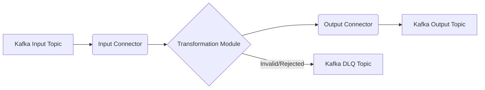

# Order Processing Pipeline

This application implements a real-time order processing pipeline using Kafka for input and output, and a dedicated transformation module for business logic.

## Architecture



## Features
- **Input Connector**: Consumes raw JSON order messages from a configurable Kafka topic.
- **Transformation Module**: 
    - Applies business rules, including a configurable minimum order value.
    - Processes messages at a configurable interval.
- **Output Connector**: Publishes processed/transformed orders to a configurable Kafka topic.
- **Configurable**: All Kafka connection settings, topic names, and business logic parameters are managed via environment variables.
- **Error Handling**: Includes dead-letter queue (DLQ) for failed messages.

## Setup

1.  **Environment Variables**: Create a `.env` file based on `.env.example` and fill in your details.

    ```bash
    cp .env.example .env
    # Edit .env with your specific values
    ```

2.  **Install Dependencies**: If running locally outside Docker.

    ```bash
    pip install -r requirements.txt
    ```

3.  **Run Application**:

    ```bash
    python main.py
    ```

## Docker

To build and run the application using Docker:

```bash
# Build the Docker image
docker build -t order-processing-pipeline .

# Run the Docker container (replace with your actual environment variables)
docker run -d --name order-processing-pipeline \
    -e KAFKA_BOOTSTRAP_SERVERS="your_bootstrap_servers" \
    -e KAFKA_SECURITY_PROTOCOL="SASL_PLAINTEXT" \
    -e KAFKA_SASL_MECHANISM="SCRAM-SHA-512" \
    -e KAFKA_SASL_USERNAME="your_username" \
    -e KAFKA_SASL_PASSWORD="your_password" \
    -e INPUT_CONNECTOR_TOPIC="raw-orders" \
    -e INPUT_CONNECTOR_GROUP_ID="order-input-group" \
    -e TRANSFORM_MIN_ORDER_VALUE=10.0 \
    -e TRANSFORM_PROCESSING_INTERVAL_SEC=1 \
    -e OUTPUT_CONNECTOR_TOPIC="processed-orders" \
    -e KAFKA_DLQ_TOPIC="order-dlq" \
    order-processing-pipeline
```

## Project Structure

```
order_processing_pipeline/
├── Dockerfile
├── README.md
├── requirements.txt
├── .env.example
├── env_variables.json
├── config.py
├── input_connector.py
├── transformation.py
├── output_connector.py
├── main.py
├── samples/
│   ├── raw_order.json
│   └── processed_order.json
└── test_pipeline.py
```
